# DSH Desk Pet

<p align="center"><a href="README_EN.md">English</a> · <b>简体中文</b></p>

<p align="center">
  <b>一只跟着你的 agent 换表情的桌宠。<br>
  换成你自己的猫也行。</b>
</p>

<p align="center">
  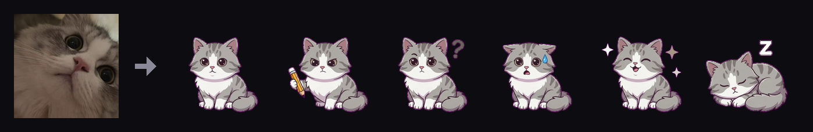
</p>
<p align="center">
  <sub>进去一张照片，出来六个状态：空闲、干活、等你、报错、开心、睡着。<br>
  生图跑的是你自己的工具、烧的是你自己的额度，我这边不往任何地方传东西。</sub>
</p>

<p align="center">
  <a href="https://www.npmjs.com/package/deepseek-desk-pet"></a>
  <a href="LICENSE"></a>
  
  
  <a href="https://github.com/topics/dsh-plugin"></a>
</p>

<p align="center">
  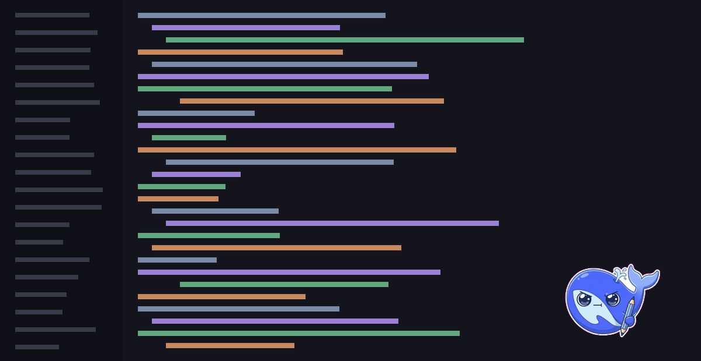
</p>
<p align="center">
  <sub>它是一个真的 macOS 窗口，不是塞进 DSH 页面里的挂件。<br>
  盖在我正在用的一切上面，全屏也盖得住，不用我告诉它现在该显示什么。</sub>
</p>

---

## 安装

已经有 DSH 的话，一条命令：

```bash
dsh plugin --profile web add deepseek-desk-pet
dsh web
```

装完宠物就浮在桌面上了，DSH 页面本身不会被塞任何东西。

从旧版本升级得带 `@latest`：

```bash
dsh plugin --profile web add deepseek-desk-pet@latest
```

不带的话写进去的是 `^0.x` 范围，而 caret 作用在 `0.x` 上会锁住次版本号，`^0.1.0` 永远不接受 `0.2.0`。裸命令会报一句 Already up to date，旧版本原地不动。

不想装 DSH、只想看宠物：克隆下来跑 `./bin/dsh-desk-pet`。

想跟 main 分支而不是发布版：

```bash
dsh plugin --profile web add github:anneheartrecord/dsh-desk-pet#main
```

> 包名叫 **deepseek-desk-pet**，仓库叫 **dsh-desk-pet**。npm 认为 `dsh-desk-pet`
> 和一个无关的 `dsh-deskpet` 太像，拒绝发布，所以两个名字不一致。

**零依赖。** 装它不用先装别的东西，不用编译，也不需要 ffmpeg。跑的是系统自带的 python。

## 使用

| | |
|---|---|
| **拖** | 按住身体任意处。放哪下次就从哪开始。 |
| **点一下** | 展开会话清单：有哪些 DSH 会话、哪个还活着、各自在干什么。再点一下收起。 |
| **免打扰** | 让它安静，直到你自己关掉。agent 照常干活，宠物不再反应。摸它还是会弹一下。 |
| **右键** | 菜单：免打扰、会话清单、皮肤、宠物出现在哪、项目主页、检查更新、退出。 |
| **停掉** | `./bin/dsh-desk-pet --stop`，或者直接停 `dsh web`。 |

它是后台进程，启动之后就脱离终端了，所以开它的那个窗口可以直接关。

## 状态

<p align="center">
  
</p>

跟着本地 DSH 自动变，没有需要配的东西。

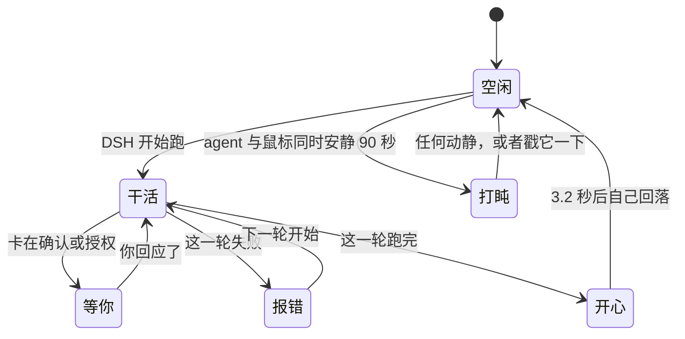

| 状态 | 什么时候 |
| --- | --- |
| **空闲** | 没事干，会呼吸、偶尔眨眼 |
| **干活** | DSH 正在跑 |
| **等你** | 卡在确认、授权、要你输入 |
| **报错** | 跑挂了 |
| **开心** | 刚跑完一轮，3.2 秒后自己回到空闲 |
| **睡着** | agent 闲着**且**你的鼠标也不动了才打盹，一有动静或者你戳它就醒 |


## 皮肤

<p align="center">
  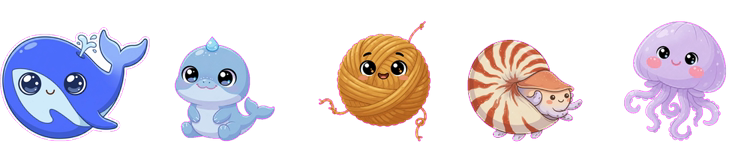
</p>

在右键菜单的皮肤子菜单里挑，或者用 `--skin <id>` 指定启动时用哪套。每套六个状态齐全，每个状态三帧。

| 皮肤 | 动起来 |
|---|---|
| **深索鲸（默认）** | 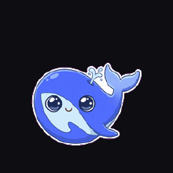 |
| **蓝鲸** | 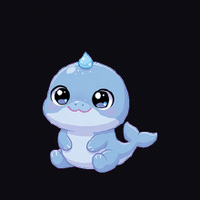 |
| **线核** | 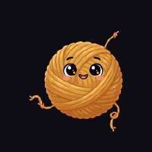 |
| **鹦鹉螺** | 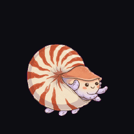 |
| **水母** | 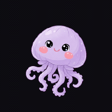 |

> 空闲是 2.4 秒静止，然后一次很短的眨眼。三帧均分我试过，效果不好。

### 每套皮肤的六个状态

顺序：空闲 · 干活 · 等你 · 报错 · 开心 · 睡着

<p align="center">
  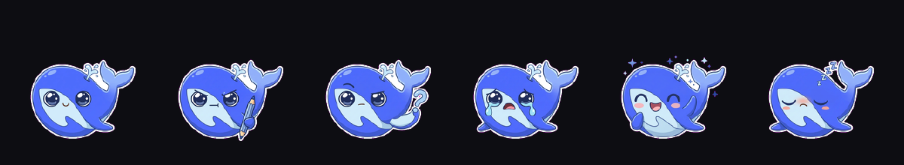
</p>
<p align="center"><sub>深索鲸（默认）</sub></p>

<p align="center">
  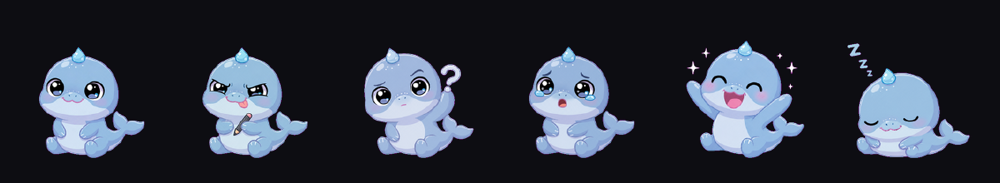
</p>
<p align="center"><sub>蓝鲸</sub></p>

<p align="center">
  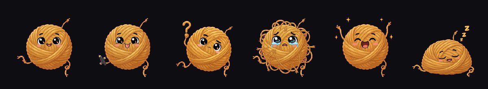
</p>
<p align="center"><sub>线核</sub></p>

<p align="center">
  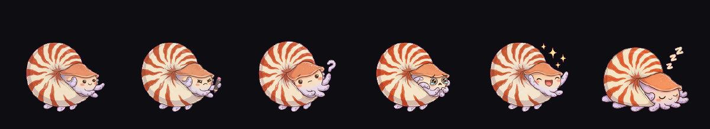
</p>
<p align="center"><sub>鹦鹉螺</sub></p>

<p align="center">
  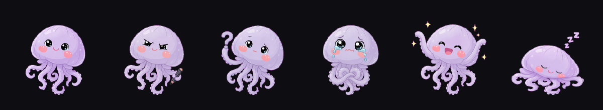
</p>
<p align="center"><sub>水母</sub></p>

### 用一张图做你自己的皮肤

把一张图交给你的 agent，让它做一套桌宠皮肤。插件里带了个 skill，负责把这张图扩写成一套皮肤要的十八个姿势，六个状态每个三帧。生图是你自己的工具在跑，烧的是你自己的额度，我这边不往任何地方发东西。做好的皮肤落在 `~/.dsh-desk-pet/skins/`，在安装包外面，所以升级插件不会把它删掉。

十八张图烧的是真金白银，所以 skill 中途会停两次让你确认：第一张画出来先看角色对不对，第二张画出来再确认还是同一个角色。半路失败会告诉你缺哪几个，已经生出来的那些留着。

做好之后可以拿出来给人看。一条命令把六个状态拼成一张图：

```bash
./bin/dsh-desk-pet --skin-sheet <你的皮肤id>
```

欢迎投进 [皮肤画廊](SKINS.md)，只交那一张预览图，帧素材留你自己机器上。

## 参数

```bash
./bin/dsh-desk-pet --scale 0.5      # 更小（默认 0.7）
./bin/dsh-desk-pet --skin jellyfish # 指定启动时的皮肤
./bin/dsh-desk-pet --reset          # 忘掉存下来的位置、大小、皮肤
./bin/dsh-desk-pet --stop           # 停掉正在跑的那只
./bin/dsh-desk-pet --foreground     # 前台跑，日志打到当前终端
./bin/dsh-desk-pet --probe          # 自检，不开窗
./bin/dsh-desk-pet --inventory      # 每套皮肤每个状态有几帧
```

## 已知限制

- 宠物四周有一圈透明边距，点在那上面不会穿透到后面的窗口。
- 这一版没有设置窗口，也没有贴边的 mini 模式。
- 生成皮肤的时候这边不显示进度，那十八张图期间你只能看自己 agent 的输出。
- 只支持 macOS。Windows 和 Linux 我没有机器测，短期也不打算做。

它内部怎么跑的、以及我当时选错过哪几个地方，写在 [docs/INTERNALS.zh-CN.md](docs/INTERNALS.zh-CN.md)。

后面想做什么、什么不打算做，写在 [docs/ROADMAP.md](docs/ROADMAP.md)。

## 许可

MIT。
