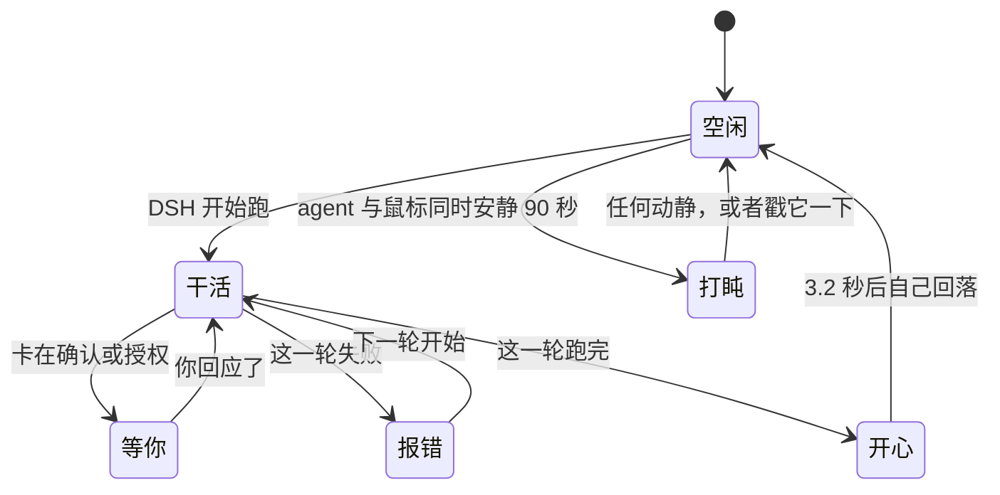

# DSH Desk Pet

<p align="center"><a href="README_EN.md">English</a> · <b>简体中文</b></p>

<p align="center">
  <b>一只跟着你的 agent 换表情的桌宠。<br>
  它可以长成你自己的猫。</b>
</p>

<p align="center">
  
</p>
<p align="center">
  <sub>进去一张照片，出来六个状态：空闲、干活、等你、报错、开心、睡着。<br>
  生图跑的是你自己的工具、烧的是你自己的额度，我这边不往任何地方传东西。</sub>
</p>

<p align="center">
  <a href="https://www.npmjs.com/package/deepseek-desk-pet"></a>
  <a href="LICENSE"></a>
  
  
  <a href="https://github.com/topics/dsh-plugin"></a>
</p>

<p align="center">
  
</p>
<p align="center">
  <sub>它是一个真的 macOS 窗口，不是塞进 DSH 页面里的挂件。<br>
  盖在我正在用的一切上面，全屏也盖得住，不用我告诉它现在该显示什么。</sub>
</p>

---

## 安装

已经有 DSH 的话，一条命令：

```bash
dsh plugin --profile web add deepseek-desk-pet
dsh web
```

装完宠物就浮在桌面上了，DSH 页面本身不会被塞任何东西。

**从旧版本升级得带 `@latest`。** 这个我自己踩过：

```bash
dsh plugin --profile web add deepseek-desk-pet@latest
```

不带的话写进去的是 `^0.x` 范围，而 caret 作用在 `0.x` 上会锁住次版本号，`^0.1.0` 永远不接受 `0.2.0`。裸命令给你报一句 Already up to date，旧版本原地不动，我当时以为是自己发版发错了。

不想装 DSH、只想看宠物：克隆下来跑 `./bin/dsh-desk-pet`。

想跟 main 分支而不是发布版：

```bash
dsh plugin --profile web add github:anneheartrecord/dsh-desk-pet#main
```

> 包名叫 **deepseek-desk-pet**，仓库叫 **dsh-desk-pet**。不是我手抖，是 npm 认为
> `dsh-desk-pet` 和一个跟我毫无关系的 `dsh-deskpet` 太像，直接拒了。它比较的时候
> 会把连字符去掉，两个名字归一化之后一模一样。

**零依赖。** 跑系统自带的 `/usr/bin/python3`，靠 `ctypes` 直接调 AppKit。不装东西、不用编译，连 `ffmpeg` 都不要，解码、抠图、缩放全是标准库写的。

## 使用

| | |
|---|---|
| **拖** | 按住身体任意处。放哪下次就从哪开始。 |
| **点一下** | 展开会话清单：有哪些 DSH 会话、哪个还活着、各自在干什么。再点一下收起。 |
| **免打扰** | 让它安静，直到你自己关掉。agent 照常干活，宠物不再反应。摸它还是会弹一下。 |
| **右键** | 菜单：免打扰、会话清单、皮肤、宠物出现在哪、检查更新、退出。 |
| **停掉** | `./bin/dsh-desk-pet --stop`，或者直接停 `dsh web`。 |

它是后台进程，启动之后就脱离终端了，所以开它的那个窗口可以直接关。

## 状态

<p align="center">
  
</p>

跟着本地 DSH 自动变，没有需要配的东西。



| 状态 | 什么时候 |
| --- | --- |
| **空闲** | 没事干，会呼吸、偶尔眨眼 |
| **干活** | DSH 正在跑 |
| **等你** | 卡在确认、授权、要你输入 |
| **报错** | 跑挂了 |
| **开心** | 刚跑完一轮，3.2 秒后自己回到空闲 |
| **睡着** | agent 闲着**且**你的鼠标也不动了才打盹，一有动静或者你戳它就醒 |

最后一条我特意用了两个时钟。agent 没事干，和桌前没人，不是一回事。

## 皮肤

<p align="center">
  
</p>

在右键菜单的皮肤子菜单里挑，或者用 `--skin <id>` 指定启动时用哪套。每套六个状态齐全，每个状态三帧。

| 皮肤 | 动起来 |
|---|---|
| **深索鲸（默认）** |  |
| **蓝鲸** |  |
| **线核** |  |
| **鹦鹉螺** |  |
| **水母** |  |

> 动图是按 `manifest.json` 里的真实时间轴播的：空闲是 2.4 秒静止，然后一次几十毫秒的眨眼。
> 三帧均分我试过，那样看起来是在抽搐，不是在呼吸。

### 每套皮肤的六个状态

顺序：空闲 · 干活 · 等你 · 报错 · 开心 · 睡着

<p align="center">
  
</p>
<p align="center"><sub>深索鲸（默认）</sub></p>

<p align="center">
  
</p>
<p align="center"><sub>蓝鲸</sub></p>

<p align="center">
  
</p>
<p align="center"><sub>线核</sub></p>

<p align="center">
  
</p>
<p align="center"><sub>鹦鹉螺</sub></p>

<p align="center">
  
</p>
<p align="center"><sub>水母</sub></p>

### 用一张图做你自己的皮肤

把一张图交给你的 agent，让它做一套桌宠皮肤。插件里带了个 skill，负责把这张图扩写成一套皮肤要的十八个姿势，六个状态每个三帧。生图是你自己的工具在跑，烧的是你自己的额度，我这边不往任何地方发东西。做好的皮肤落在 `~/.dsh-desk-pet/skins/`，在安装包外面，所以升级插件不会把它删掉。

skill 中途会停两次。第一次在基准姿势之后，让你在多花十七张之前先看看这个角色对不对；第二次在第二帧之后，确认重画一次之后还是同一个角色。这两次不是我谨慎，是文生图跨次调用锁不住身份，你的工具要是不支持拿上一次的结果当参考图，十八张会是十八个不同的角色，而且每一张单独看都挑不出毛病。半路失败会告诉你缺哪几个，已经花钱生出来的那些留着。

做好之后可以拿出来给人看。一条命令把六个状态拼成一张图：

```bash
./bin/dsh-desk-pet --skin-sheet <你的皮肤id>
```

欢迎投进 [皮肤画廊](SKINS.md)，只交那一张预览图，帧素材留你自己机器上。

## 参数

```bash
./bin/dsh-desk-pet --scale 0.5      # 更小（默认 0.7）
./bin/dsh-desk-pet --skin jellyfish # 指定启动时的皮肤
./bin/dsh-desk-pet --reset          # 忘掉存下来的位置、大小、皮肤
./bin/dsh-desk-pet --stop           # 停掉正在跑的那只
./bin/dsh-desk-pet --foreground     # 前台跑，日志打到当前终端
./bin/dsh-desk-pet --probe          # 自检，不开窗
./bin/dsh-desk-pet --inventory      # 每套皮肤每个状态有几帧
```

## 原理

它盯着 `~/.dsh` 里的进程、会话活动和一个可选的提示文件，把看到的东西映射成六个状态。想手动驱动的话：

```bash
echo '{"kind":"working"}' > ~/.dsh/pet-activity.json
rm ~/.dsh/pet-activity.json          # 交还给自动检测
```

它把看到的写进 `~/.dsh-desk-pet/state.json`。第二次启动靠这个文件判断是不是已经有一只在跑，`--stop` 也靠它找进程。

页面里曾经还有一只镜像宠物，我后来整个删了。一个屏幕上两只宠物本来就像 bug，而且出问题的一直是那只镜像。真正值得留的是浮在所有窗口之上的这个窗口。

### 为什么是 AppKit 不是 Tk

macOS 自带的 Tcl/Tk 是 2010 年发布的 8.5.9，在 macOS 26 上它的绘制路径已经到不了屏幕。窗口能建出来，画布自报已映射、可见、尺寸正确、图片在正确的坐标上，屏幕上是一个空的灰方块。

我一开始完全不信是 Tk 的问题，觉得肯定是自己哪里写错了。换透明、换无边框、换回不透明、换 MacWindowStyle，一样。两天就这么没了。

最后改成用 `ctypes` 直接建在 AppKit 上。代码是多了不少，但白拿了三件 Tk 根本给不了的东西：真 alpha，不再是 GIF 那种一位遮罩；能跨全屏 Space 的窗口层级；以及作为子窗口跟着宠物一起搬的会话面板。

## 开发

```bash
/usr/bin/python3 -m unittest discover -t . -s tests -v     # 267 个测试，不需要显示器
DSH_PET_ART_CHECK=1 /usr/bin/python3 -m unittest discover -t . -s tests   # 加上逐像素素材闸
node tests/plugin_smoke.mjs                                 # 插件那一侧
```

### 素材流水线

```bash
./scripts/generate_frames.py    # 补齐缺的姿势
./scripts/build_frames.py       # 抠底、对齐、缩放
./scripts/check_frames.py       # 逐像素体检
./scripts/contact_sheet.py      # 拼一张总览图，不开窗也能看
./scripts/media_sheets.py       # 出 README 用的预览图和动图
```

新素材的背景一律用品红 `#FF00FF`，装饰也不能用品红。底色必须是画面里绝不出现的颜色。第一批我生在粉彩底上，水母那套是薄荷绿，和角色自己的颜色太近，抠图阈值怎么调都会误伤。那批水母的眼睛就是这么被抠没的，而且当时 87 个测试全绿，因为没有一个测试在看像素。

`generate_frames` 从不凭空重画角色，每次请求都是拿一张已有的图做 image-to-image。状态的第一帧参考本套皮肤的 idle 姿势，第二帧参考它自己的第一帧，因为循环要的是同一个姿势差一瞬间，不是两个不同的姿势。

`check_frames` 是唯一会看像素的测试。其余测试只能比文件名，某套皮肤曾经带着一脸窟窿通过了全部测试。

### 自定义皮肤

皮肤就是一个装帧的目录。只要 `assets/web/<id>/<状态>/*.png` 存在，它自动进换肤循环，不用改代码。

## 已知限制

- 窗口是个矩形，所以点在宠物周围透明边距上的时候不会穿透到后面去。逐像素穿透我写好了也测了，就是还没接上 AppKit 那一侧。
- 这一版没有设置窗口，也没有贴边的 mini 模式。
- 生成皮肤的时候这边不显示进度，那十八张图期间你只能看自己 agent 的输出。
- 只支持 macOS。渲染层是 AppKit，Windows 和 Linux 我没有机器测，短期也不打算做。

接下来做什么、以及明确不做什么，都在 [docs/ROADMAP.md](docs/ROADMAP.md)。

## 许可

MIT。
