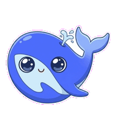

# DSH Desk Pet

<p align="center">
  
</p>

<p align="center">
  <b>一只能看出 agent 在干什么的桌宠。</b><br>
  它浮在所有窗口之上（包括全屏），跟着 DSH 干活、等你、跑完、报错换表情。
</p>

<p align="center">
  <a href="LICENSE"></a>
  
  
  <a href="https://github.com/topics/dsh-plugin"></a>
</p>

<p align="center">
  
</p>
<p align="center">
  <sub>空闲 · 干活 · 等你 · 报错 · 开心 · 睡着</sub>
</p>

<p align="center"><a href="README.md">English</a></p>

---

## 安装

已有 DSH，一条命令：

```bash
dsh plugin --profile web add github:anneheartrecord/dsh-desk-pet#main
dsh web
```

宠物会浮在桌面上，DSH 页面右下角还有一只同步的镜像。

不要 DSH、只开宠物：克隆后执行 `./bin/dsh-desk-pet`。

**零依赖。** 跑在系统自带的 `/usr/bin/python3` 上，靠 `ctypes` 直接调 AppKit。不装任何东西，也不用编译。

## 使用

| | |
|---|---|
| **拖** | 按住身体任意处。放在哪，下次就从哪开始。 |
| **点一下** | 打开会话清单，列出有哪些 DSH 会话、哪个活着、在干什么。再点一下收起。 |
| **右键** | 循环换皮肤。 |
| **停止** | `./bin/dsh-desk-pet --stop`，或者停掉 `dsh web`。 |

它以后台进程启动、脱离终端，所以启动它的那个窗口可以直接关掉。

## 状态

跟着本地 DSH 自动变，不用管。

| 状态 | 什么时候 |
| --- | --- |
| **空闲** | 没事干，会呼吸、偶尔眨眼 |
| **干活** | DSH 正在跑 |
| **等你** | 卡在确认、授权、要你输入 |
| **报错** | 跑挂了 |
| **开心** | 刚跑完一轮，几秒后自己回到空闲 |
| **睡着** | agent 闲着**且**你的鼠标也不动了才打盹；一有动静或者你戳它就醒 |

最后一条特意用了两个时钟：agent 没事干，和桌前没人，不是一回事。

## 皮肤

<p align="center">
  
</p>
<p align="center">
  <sub>深索鲸（默认）· 蓝鲸 · 线核 · 鹦鹉螺 · 水母</sub>
</p>

右键循环，或者 `--skin <id>`。每套皮肤六个状态齐全，每个状态三帧。

## 参数

```bash
./bin/dsh-desk-pet --scale 0.5      # 更小（默认 0.7）
./bin/dsh-desk-pet --skin jellyfish # 指定启动时的皮肤
./bin/dsh-desk-pet --reset          # 忘掉已保存的位置、大小、皮肤
./bin/dsh-desk-pet --stop           # 停掉正在跑的宠物
./bin/dsh-desk-pet --foreground     # 前台运行，日志打到当前终端
./bin/dsh-desk-pet --probe          # 自检，不开窗
./bin/dsh-desk-pet --inventory      # 每套皮肤每个状态有几帧
```

## 原理

宠物盯着 `~/.dsh` 的进程、会话活动和一个可选的提示文件，把看到的映射成六个状态。想手动驱动：

```bash
echo '{"kind":"working"}' > ~/.dsh/pet-activity.json
rm ~/.dsh/pet-activity.json          # 交还给自动检测
```

只有桌面这只在观察 DSH。它把看到的写进 `~/.dsh-desk-pet/state.json`，网页那只读这个文件。「agent 在干什么」只有一份实现，不是两份会互相打架的。

### 为什么是 AppKit 不是 Tk

macOS 自带的是 2010 年发布的 Tcl/Tk 8.5.9，在 macOS 26 上它的绘制路径已经到不了屏幕：窗口能映射，画布自报已映射、可见、尺寸正确、图元在正确坐标上。屏幕上是一个空的灰方块。

所以窗口改成用 `ctypes` 直接建在 AppKit 上。代码是多了，但换来三件 Tk 根本给不了的东西：真 alpha（不再是 GIF 的一位遮罩）、能跨全屏 Space 的窗口层级、以及作为子窗口跟着宠物一起走的会话面板。

## 开发

```bash
/usr/bin/python3 -m unittest discover -s tests -v          # 145 个测试，不需要显示器
DSH_PET_ART_CHECK=1 /usr/bin/python3 -m unittest discover -s tests   # 加上逐像素素材闸门
node tests/plugin_smoke.mjs                                 # 插件的 HTTP 路由
```

### 素材流水线

```bash
./scripts/generate_frames.py    # 补齐缺的姿势
./scripts/build_frames.py       # 抠底、对齐、缩放，产出两套帧
./scripts/check_frames.py       # 逐像素体检
./scripts/contact_sheet.py      # 拼一张总览图，不开窗也能看效果
```

新素材的**背景一律用品红 `#FF00FF`**，装饰不能用品红。底色必须是画面里绝不出现的颜色：第一批素材生在粉彩底上（水母是薄荷绿），和角色自身颜色太近，抠图阈值怎么调都会误伤，那批水母的眼睛就是这么被抠没的。

**generate_frames** 从不凭空重画角色：每次请求都是拿一张已有的图做 image-to-image，因为文生图跨次调用锁不住身份。状态的第一帧参考本套皮肤的 idle 姿势，第二帧参考**它自己的第一帧**，因为循环要的是同一个姿势差一瞬间，不是两个不同姿势。

**check_frames** 是唯一会看像素的测试。其余测试只能比较文件名。某套皮肤曾经带着一脸窟窿通过了全部测试。

### 自定义皮肤

皮肤就是一个装帧的目录。只要 `assets/skins/<id>/<状态>/*.png` 存在，它就会自动进入换肤循环，不用改代码。

## 已知限制

- 窗口是矩形，所以落在宠物周围透明边距上的点击不会穿透到后面。逐像素点击穿透代码写好了，但还没接上。
- 还没有右键菜单，右键目前是循环换肤。

接下来做什么、以及明确不做什么：[docs/ROADMAP.md](docs/ROADMAP.md)。

## 许可

MIT。
