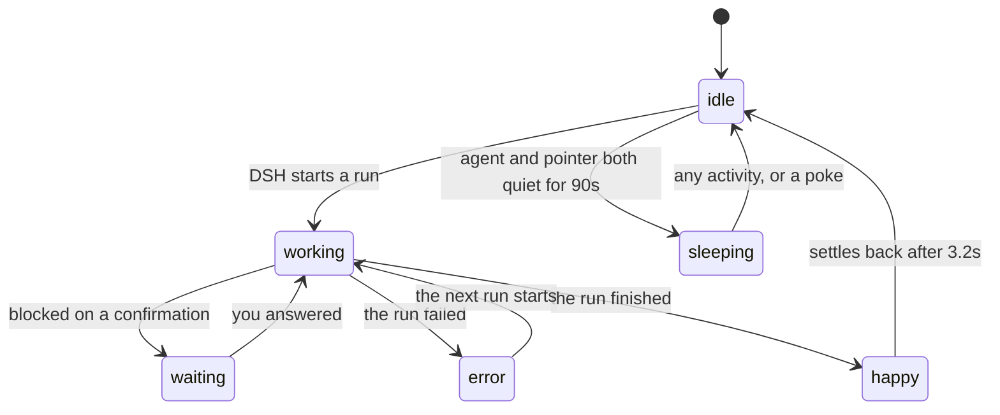

# DSH Desk Pet

<p align="center"><b>English</b> · <a href="README.md">简体中文</a></p>

<p align="center">
  <b>A desk pet that shows you what your DSH agent is doing.<br>
  It can be your own cat.</b>
</p>

<p align="center">
  
</p>
<p align="center">
  <sub>One photo in, six states out — idle, working, waiting, error, happy, sleeping.<br>
  Generated by your own image tool on your own credentials. Nothing is sent anywhere by us.</sub>
</p>

<p align="center">
  <a href="https://www.npmjs.com/package/deepseek-desk-pet"></a>
  <a href="LICENSE"></a>
  
  
  <a href="https://github.com/topics/dsh-plugin"></a>
</p>

<p align="center">
  
</p>
<p align="center">
  <sub>A real macOS window, not a widget inside the DSH page. It stays above everything you<br>
  work in, fullscreen Spaces included, and follows the agent without being told.</sub>
</p>

---

## Install

With DSH already set up, one command:

```bash
dsh plugin --profile web add deepseek-desk-pet
dsh web
```

**Upgrading from an earlier version needs `@latest`:**

```bash
dsh plugin --profile web add deepseek-desk-pet@latest
```

The bare form writes a `^0.x` range, and a caret on a `0.x` version pins the
minor — so `^0.1.0` never accepts `0.2.0`, and the plain command reports
"Already up to date" while leaving the old version in place.

The pet appears on your desktop, floating above whatever you are working in.
Nothing is added to the DSH page itself.

Pet only, no DSH: clone the repo and run `./bin/dsh-desk-pet`.

To follow the main branch instead of the published version:

```bash
dsh plugin --profile web add github:anneheartrecord/dsh-desk-pet#main
```

> The npm package is **deepseek-desk-pet** while the repo is **dsh-desk-pet**:
> npm rejects `dsh-desk-pet` as too similar to an unrelated `dsh-deskpet`.


**No dependencies.** It runs on the system `/usr/bin/python3` and talks to
AppKit through `ctypes`. Nothing to install, nothing to build — not even
`ffmpeg`: decoding, keying and scaling frames is all standard library.

## Use

| | |
|---|---|
| **Drag** | Grab it anywhere. Where you leave it is where it starts next time. |
| **Click** | Opens the session list — which DSH sessions exist, which is live, what it is doing. Click again to close. |
| **Sleep (Do Not Disturb)** | Quiets the pet until you turn it off. The agent keeps working; the pet stops reacting. Petting it still gets a bounce. |
| **Right-click** | Opens the menu: quiet mode, the session list, skins, where the pet shows up, updates, quit. |
| **Stop** | `./bin/dsh-desk-pet --stop`, or stop `dsh web`. |

It starts in the background and detaches from your terminal, so you can close
the window you launched it from.

## States

<p align="center">
  
</p>

Driven by your local DSH. Nothing to configure.



| State | When |
| --- | --- |
| **idle** | Nothing to do — breathes, blinks now and then |
| **working** | DSH is running |
| **waiting** | Blocked on a confirmation, approval, or your input |
| **error** | The run failed |
| **happy** | A run just finished; settles back to idle after a few seconds |
| **sleeping** | Dozes when the agent is idle **and** your pointer has stopped moving. Any activity, or a poke, wakes it. |

That last one takes two clocks on purpose: an agent with nothing to do is not
the same thing as a desk with nobody at it.

## Skins

<p align="center">
  
</p>

Pick one from the Skin submenu, or start on it with `--skin <id>`. Every skin
has all six states at three frames each.

| Skin | In motion |
|---|---|
| **DeepSeek Whale (default)** |  |
| **Blue Whale** |  |
| **Threadcore** |  |
| **Nautilus** |  |
| **Jellyfish** |  |

> The loops play at the real cadence out of `manifest.json`: idle is 2.4 seconds
> of stillness and then a blink measured in tens of milliseconds. Give the three
> frames equal time and the pet reads as twitching rather than breathing.

### Every skin, all six states

In order: idle · working · waiting · error · happy · sleeping

<p align="center">
  
</p>
<p align="center"><sub>DeepSeek Whale (default)</sub></p>

<p align="center">
  
</p>
<p align="center"><sub>Blue Whale</sub></p>

<p align="center">
  
</p>
<p align="center"><sub>Threadcore</sub></p>

<p align="center">
  
</p>
<p align="center"><sub>Nautilus</sub></p>

<p align="center">
  
</p>
<p align="center"><sub>Jellyfish</sub></p>

**Make your own from a picture.** Hand an image to your agent and ask it to make
a desk pet skin. A skill ships with the plugin that turns one image into the
eighteen poses a skin needs — six states, three frames each. Your own image tool
does the generating, on your own credentials; nothing is sent anywhere by us.
Your skins live in `~/.dsh-desk-pet/skins/`, outside the package, so upgrading
the plugin does not delete them.

The skill stops twice on the way: once after the first pose, so you can throw it
away before paying for seventeen more, and once after the second, to check the
character survived being redrawn. If a run half-fails it tells you which poses
are missing and keeps the ones you already paid for.

## Options

```bash
./bin/dsh-desk-pet --scale 0.5      # smaller (default 0.7)
./bin/dsh-desk-pet --skin jellyfish # start on a specific skin
./bin/dsh-desk-pet --reset          # forget saved position, size and skin
./bin/dsh-desk-pet --stop           # stop the running pet
./bin/dsh-desk-pet --foreground     # stay attached, log to this terminal
./bin/dsh-desk-pet --probe          # diagnostics, no window
./bin/dsh-desk-pet --inventory      # frames per skin per state
```

## How it works

The pet watches `~/.dsh` — running processes, session activity, and an optional
hint file — and maps what it finds onto the six states. To drive it by hand:

```bash
echo '{"kind":"working"}' > ~/.dsh/pet-activity.json
rm ~/.dsh/pet-activity.json          # back to automatic
```

The pet publishes what it sees to `~/.dsh-desk-pet/state.json`, which is how a
second launch knows one is already running and how `--stop` finds it.

There was briefly a second pet mirrored into the DSH page. It is gone: two pets
on one screen read as a bug, and the mirror was where the failures lived. The
window that floats over everything is the thing worth having.

### Why AppKit and not Tk

macOS ships Tcl/Tk 8.5.9, released in 2010, and on macOS 26 its drawing path no
longer reaches the screen: the window maps, the canvas reports itself mapped,
viewable, correctly sized and holding an image at the right coordinates — and
what appears is an empty grey rectangle.

So the window is built directly on AppKit through `ctypes`. That is more
machinery, and it buys three things Tk could not offer at all: real alpha
instead of a 1-bit GIF matte, a window level that clears fullscreen Spaces, and
a session panel that travels with the pet as a child window.

## Development

```bash
/usr/bin/python3 -m unittest discover -t . -s tests -v     # 148 tests, no display needed
DSH_PET_ART_CHECK=1 /usr/bin/python3 -m unittest discover -t . -s tests   # + the pixel gate
node tests/plugin_smoke.mjs                                 # the plugin's HTTP routes
```

### The art pipeline

```bash
./scripts/generate_frames.py    # fill in missing poses
./scripts/build_frames.py       # key, align, scale; writes both frame sets
./scripts/check_frames.py       # per-pixel inspection
./scripts/contact_sheet.py      # one reviewable image, no window required
```

New art goes on a **magenta `#FF00FF` background**, and props must not use
magenta. The plate has to be a colour the artwork never contains: the first
batch was generated on pastel plates — mint green behind the jellyfish — close
enough to the characters that no key threshold could separate them, which is how
that jellyfish once shipped with its eyes cut out.

**generate_frames** never redraws a character from scratch; every request is an
image-to-image edit of an existing still, because text-to-image cannot hold
identity across calls. Frame `00` of a state edits from the skin's idle pose;
frame `01` edits from **frame 00 of its own state**, because a loop needs the
same pose an instant later, not two different poses.

**check_frames** is the only test that looks at pixels. Everything else can
only compare filenames — which is how a skin once passed the entire suite with
holes punched through its face.

### Custom skins

A skin is a folder of frames. Anything at `assets/web/<id>/<state>/*.png`
appears in the cycle on its own, with no code change.

## Known limits

- The window is a rectangle, so clicks landing on the transparent margin around
  the pet do not reach what is behind it. Per-pixel click-through is written but
  not yet wired up.
- A settings window and mini mode are not in this version.
- Nothing shows progress while a skin generates; your agent's own output is the
  only feedback during the eighteen images.

What is planned next, and what is deliberately not: [docs/ROADMAP.md](docs/ROADMAP.md).

## License

MIT.
