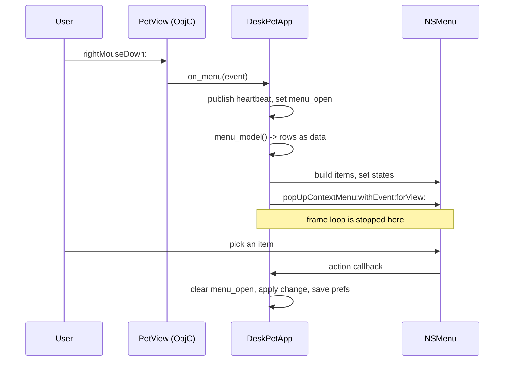
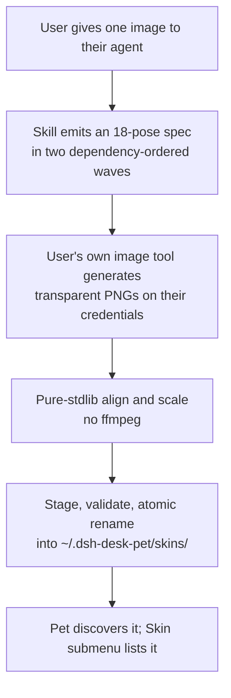

# Native Menu and DIY Skins - Plan

## Goal Capsule

**Objective.** Ship v2 of the desk pet: replace right-click skin-cycling with a native `NSMenu`, and let a user turn one image into a selectable skin using their own image tool and their own credentials.

**Authority hierarchy.** Requirements (R-IDs) win on product behavior. Key Technical Decisions (KTD-IDs) win on mechanism within those requirements. Units override neither.

**Stop conditions.** Stop and ask rather than guess when: a menu item would need a settings window or new per-skin art (both are v3, see Scope Boundaries); the pure-stdlib image path cannot hit the measured budget in KTD9; or a skin format change would break the five shipped skins.

**Execution profile.** The renderer is AppKit reached through `ctypes`. There are no third-party packages and there is no build step. Every new Objective-C selector needs its own `CFUNCTYPE` prototype and a matching type-encoding string, and every callback must be retained. Getting a struct-argument encoding wrong does not raise — it silently returns garbage, which is why `hitTest:` was backed out of v1.

**Tail ownership.** The implementer runs the Verification Contract, updates both READMEs, and folds shipped items out of `docs/ROADMAP.md`. Publishing to npm is not part of this work.

---

## Product Contract

### Summary

Right-click currently advances to the next skin. v2 replaces that with a real menu carrying seven items: Sleep (Do Not Disturb), Open Dashboard, a Skin submenu, Show in Menu Bar, Show in Dock, Check for Updates, and Quit.

Alongside it, a shipped Skill turns one user-supplied image into a full skin. The Skill does not generate art. It emits a dependency-ordered specification of eighteen poses, the user's own agent generates them with its own image tool on transparent backgrounds, and the pet's code aligns and scales the results into a skin.

### Problem Frame

Right-click cycling was the cheapest way to prove multiple skins load. It is the wrong interaction to keep: there is no way to see the choices, go back one, or reach a specific skin without clicking through the others. Everything else a desk pet needs — quieting it, quitting it, finding out whether it is current — has no interaction surface at all.

Separately, the five shipped skins are the only skins that will ever exist unless a user can make one. The art pipeline already turns a reference image into eighteen consistent poses, but it runs on the maintainer's credentials, needs `ffmpeg`, and is not part of the published package.

### Key Decisions

- **No mutual-exclusion guard on the visibility toggles.** The reference implementation disables the last remaining affordance because its pet can be hidden, leaving the menu bar and Dock as the only ways back. This pet has no hide, no mini mode, and no settings window, and its window is always on screen and always right-clickable. Carrying the guard across would strand a Dock icon the user cannot remove. Governs R4.
- **Seven menu items in v2; Settings and Mini Mode deferred to v3.** (session-settled: user-directed — chosen over the full eight-item reference menu: Settings needs a window UI built from scratch, and Mini Mode needs eight new poses per skin.) Governs R2.
- **Generation runs on the user's own image tool, onto a flat magenta plate, and the whole keying pipeline is reimplemented in pure stdlib.** (session-settled: user-directed — chosen over both shipping the `ffmpeg` pipeline and asking the model for transparent output.) The transparent-output route was chosen first and then withdrawn on evidence: no image backend this project has used has ever emitted an alpha channel. Of the 90 stills under `assets/source`, 18 are JPEG bytes, which cannot carry alpha at all, and the other 72 are PNG colour type 2, which is RGB with no alpha. Every pixel of transparency in the shipped art is manufactured by our own key. Governs R8, R9, R11.
- **The reference implementation is studied, never copied.** claw-on-desk is AGPL-3.0-only. This package is MIT and must stay free of its code.

### Requirements

- R1. Right-click on the pet opens a native context menu instead of changing the skin.
- R2. The menu carries, in order: Sleep (Do Not Disturb), separator, Open Dashboard, Skin submenu, separator, Show in Menu Bar, Show in Dock, separator, Check for Updates, separator, Quit.
- R3. Sleep (Do Not Disturb) suppresses state changes until the user turns it off. It does not persist across a restart.
- R4. Show in Menu Bar and Show in Dock are independent, user-toggled, and persist. Both may be off, and both are off by default. Right-clicking the pet always reaches the menu, so neither is load-bearing for reachability.
- R5. Check for Updates reports through its own menu-item label, refreshed when the menu opens rather than when the item is clicked. It never opens a modal. An `NSMenu` dismisses on selection, so a result rendered in response to a click would be shown to a menu nobody is looking at.
- R6. Open Dashboard shows the session list the pet already builds for left-click.
- R7. The Skin submenu lists every discovered skin, builtin and user-made, with the active one ticked.
- R8. A user can turn one image into a selectable skin using their own image tool and their own credentials.
- R9. Skin generation spends no credentials belonging to this project.
- R10. A generated skin survives a plugin upgrade.
- R11. Frame post-processing runs with no `ffmpeg` and no third-party package.
- R12. An incomplete or malformed generated skin never replaces a working one.
- R13. Quit stops the pet the same way `--stop` does.

### Success Criteria

- Opening and dismissing the menu leaves the animation running and does not make a concurrent launch believe the pet has died.
- A user whose agent already has an image-generation tool with reference-image support reaches a working skin without installing anything further, and is told the credit cost before any generation starts.
- A user whose agent has no such tool is told so by the Skill before the first pose is requested, not after.
- The five shipped skins render identically before and after the change.

### Scope Boundaries

**In scope.** The seven menu items, the DIY skin Skill, a user-writable skin location, and the pure-stdlib image operations that replace `ffmpeg` for the new path. Plus four pre-existing defects the above depend on: the `Prefs.clamped()` field drop, the `loop_for` empty-loop recheck against the wrong tree, the one-shot `manifest()` cache, and the missing `SIGTERM` handler. Those four touch preference repair and frame caching for existing users, which is where the regression risk to the five shipped skins sits.

**Deferred to v3.**

- Settings window. It needs a window UI built from scratch; nothing in the package has one today.
- Mini Mode. The reference implementation is not a size change — it docks to the screen edge and swaps in eight extra poses, which every user-generated skin would lack.

**Outside this product's identity.** Windows and Linux support, and configurable animation timing. Both are already recorded as not-planned in `docs/ROADMAP.md`.

**Deferred to follow-up work.** Per-pixel click-through, idle-to-sleep transition frames, clickable session rows, and the `assets/web` rename. All four are existing roadmap items that this plan deliberately does not pull in.

### Sources

- `docs/ROADMAP.md` — the v2 entries this plan supersedes, and the `assets/web` naming trap.
- claw-on-desk (`sideProjects/clawd-on-desk-nuomi-tingzijie`, AGPL-3.0-only) — studied for menu shape, DND semantics, the unreachability guard, and the delegate-generation-to-a-skill model. No code taken.
- Commit `05ad0d2` — why Tk was replaced, and the event-pump and first-mouse findings that constrain menu work.
- Commit `203facc` — why the image backend moved to Gemini, and how credentials are passed without reaching `ps`.

---

## Planning Contract

### Key Technical Decisions

- KTD1. The menu is computed as plain data in `app.py` and rendered in `nswindow.py`. This mirrors `panel_rows()`, which is what makes the panel testable with no display. Governs R2, R7.
- KTD2. Pop the menu with `popUpContextMenu:withEvent:forView:`. Its arguments are all pointers. The alternative, `popUpMenuPositioningItem:atLocation:inView:`, takes an `NSPoint` by value, which is the exact struct-encoding hazard that made `hitTest:` return garbage and forced its removal in v1.
- KTD3. Call `setAutoenablesItems:` with NO. An accessory app never becomes active, so AppKit's automatic validation would render items disabled.
- KTD4. Retain every `NSMenu`, `NSMenuItem`, and callback trampoline in the module-level `_KEEP` list. `ctypes` function pointers are collected independently of the Objective-C class that points at them.
- KTD5. Menu tracking runs its own event loop, so the frame loop stops while the menu is open. `_publish` early-returns when skin and state are unchanged and the heartbeat interval has not elapsed, so calling it before popping is usually a no-op; the pre-popup write must bypass that debounce and call `bridge.publish` directly. One write only buys a single 6000ms staleness window, and browsing a skin submenu past six seconds is ordinary, so keep publishing during tracking from a timer registered in the event-tracking run-loop mode. Without that, a concurrent launch starts a second pet while the menu is open — the failure the instance guard exists to prevent.
- KTD6. Do Not Disturb is a latch in `PetRuntime`, checked at the top of the state setter, and is not written to prefs. A non-idle observation must not clear it. Governs R3.
- KTD7. After toggling the Dock, re-apply window level and collection behavior. Showing or hiding the Dock icon resets `NSWindowCollectionBehavior`, which is what keeps the pet above fullscreen Spaces. Governs R4.
- KTD8. The update check runs when the menu opens, not when the item is clicked, and its result is cached so the label is already correct the moment the menu appears. The fetch is off the frame loop and never blocks the popup: an in-flight or failed check renders the last known result, or a neutral label on first run. Distinguish "could not check" from "up to date" — treating an unreachable registry as current would tell a user they are up to date forever. Governs R5.
- KTD9. Decode, key, measure, and scale frames in pure stdlib using `zlib`. Measured twice independently on this machine at 1024x1024, worst case (every row Paeth-filtered, which is what real encoders produce on illustration content): decode 1668-1852ms, alpha bounding box 103-165ms, crop and scale 254-486ms. **The enforced budget is 60s wall clock for eighteen frames through the full pipeline**, which is the worst case plus the keying pass plus headroom. The unfiltered figure is a best case that no real encoder produces and is not a gate. Generation itself dominates the user's actual wait; this budget covers post-processing only. Governs R11.
- KTD10. User skins live under `~/.dsh-desk-pet/skins/<id>/` with a per-skin manifest. The package tree stays read-only, which is what makes R10 hold: the installed package sits in `node_modules` and is replaced on upgrade.
- KTD11. Install a generated skin by staging it in a temporary directory, validating it, then renaming into place. Write a provenance marker; a skin directory without a marker was hand-placed by the user rather than installed by us, and is never overwritten or deleted. Governs R12.
- KTD12a. The Skill states a minimum tool contract before it asks for anything: image-to-image with an input reference, the ability to pass a previously generated frame back as the reference, PNG output, and a fixed square size. A text-to-image-only tool satisfies the pose spec literally and returns eighteen unrelated characters, every one of which would pass a per-frame validator. The Skill generates the idle pose and one dependent frame first and stops for the user to confirm the character survived, before spending the remaining sixteen.
- KTD12. The Skill emits its pose specification in two dependency-ordered waves. The first frame of each state references the idle pose, and later frames reference the first frame of their own state. Generating them independently produced a loop that read as the character exploding and re-forming once a second.

### High-Level Technical Design

Menu interaction, and where the frame loop stops:



Skin creation, and who spends what:



### Assumptions

- The user's image tool can emit PNG onto a flat background colour we specify, and can take a reference image. It does not need to emit transparency — nothing observed ever has.
- The user's tool returns PNG rather than JPEG. Decoding JPEG in pure Python means implementing Huffman and the inverse DCT, which is out of proportion to this feature, so a JPEG is refused by name rather than decoded.
- The npm registry is reachable when the user asks for an update check. It is not reachable during tests, so the check is injected rather than called directly.

### Implementation Constraints

- System `/usr/bin/python3` is 3.9.6. No `match`, no runtime `X | Y` annotations. Every module keeps `from __future__ import annotations`.
- `assets/web` is the tree the renderer plays, despite the name. Every call into `packs` passes `web=True`; the `web=False` default points at the dead GIF tree.
- `Prefs.clamped()` rebuilds the dataclass with four named fields. A new field that is not added there is silently dropped on every save.
- Never let an exception escape an Objective-C callback.

### Sequencing

U1 through U3 are the foundation: the menu model, the rendering plumbing, and the prefs fields the toggles need. Of the menu items, U4 and U6 need U3; U5 needs U1 and U2; U7 and U8 need U1. Those five can land in any order once their own dependencies are in.

U9 through U12 are the skin capability. They depend on U10's discovery root and on no menu unit, so they can proceed alongside the menu work. U13 is documentation and depends on every unit, menu units included.

---

## Implementation Units

### Unit Index

| U-ID | Title | Requirements | Key files | Depends on |
|---|---|---|---|---|
| U1 | Menu model as data | R2, R4, R7 | `src/dsh_desk_pet/app.py` | U3, U4 |
| U2 | NSMenu rendering and popup | R1 | `src/dsh_desk_pet/nswindow.py`, `app.py` | U1 |
| U3 | Prefs fields, and fix the clamp that drops them | R4 | `src/dsh_desk_pet/prefs.py` | — |
| U4 | Do Not Disturb latch | R3 | `src/dsh_desk_pet/runtime.py` | — |
| U5 | Skin submenu replaces cycling | R7 | `src/dsh_desk_pet/app.py` | U1, U2 |
| U6 | Show in Dock and Show in Menu Bar | R4 | `src/dsh_desk_pet/nswindow.py` | U1, U3 |
| U7 | Check for Updates | R5 | `src/dsh_desk_pet/updates.py` | U1 |
| U8 | Open Dashboard and Quit | R6, R13 | `src/dsh_desk_pet/app.py` | U1 |
| U9 | Pure-stdlib imaging and keying | R11 | `src/dsh_desk_pet/imaging.py`, `scripts/build_frames.py` | — |
| U10 | User skin root and discovery | R7, R10 | `src/dsh_desk_pet/skins.py`, `packs.py` | — |
| U11 | Skin install with provenance | R10, R12 | `src/dsh_desk_pet/skininstall.py` | U9, U10 |
| U12 | The generation Skill and its entry point | R8, R9 | `skills/dsh-pet-skin/SKILL.md`, `bin/dsh-desk-pet` | U11 |
| U13 | Documentation and roadmap | R1, R2, R8 | `README.md`, `README.zh-CN.md`, `docs/ROADMAP.md` | all |

U1's own test scenarios assert against the DND latch and the visibility prefs, so it cannot be written before U3 and U4 exist.

### U1. Menu model as data

**Goal.** Produce the menu as plain data so its shape is testable with no display.

**Requirements.** R2, R4, R7.

**Dependencies.** None.

**Files.** `src/dsh_desk_pet/app.py`, `tests/test_window.py`.

**Approach.** Add `menu_model()` returning an ordered list of entries, each carrying kind (item, separator, submenu), title, an action key, a checked flag, and an enabled flag. Follow `panel_rows()` — it returns plain data for the same reason. Every entry is always enabled; per R4 there is no cross-toggle disabling. The Sleep and both visibility entries carry a checked flag so the menu shows what is currently on, rather than only offering the inverse verb.

**Test scenarios.**
- The model lists the seven items and four separators in the R2 order.
- With DND off the Sleep entry is unchecked; with DND on it is checked.
- The Skin submenu contains every skin from `list_skins()` with exactly one ticked.
- Both visibility entries are enabled in all four on/off combinations, including both off.
- With both off, the model is still well-formed and every entry is enabled.
- The Dashboard entry reads Open Dashboard when the panel is hidden and Hide Dashboard when it is shown.

**Verification.** `menu_model()` is asserted directly with no window created.

### U2. NSMenu rendering and popup

**Goal.** Render the model as a real menu and pop it on right-click.

**Requirements.** R1.

**Dependencies.** U1.

**Files.** `src/dsh_desk_pet/nswindow.py`, `src/dsh_desk_pet/app.py`, `tests/test_window.py`.

**Approach.** `on_menu` currently takes no arguments and is wired to `next_skin`. It becomes a zero-argument callback returning the menu model, and the popup stays inside the view's `rightMouseDown:` trampoline, which is the only place the `NSEvent` pointer exists. Changing the signature without touching `app.py` raises a `TypeError` that the trampoline's bare `except` swallows, so right-click would silently do nothing.

Map a picked item back to its action with `setTag:`, which takes a scalar, rather than an object-valued association. Build `NSMenu` and `NSMenuItem` objects from the model. Add one action selector to the view class with encoding `v@:@` and register it the way `mouseDown:` is registered. Pop with `popUpContextMenu:withEvent:forView:` per KTD2. Disable auto-enabling per KTD3. Retain the menu, its items, and the trampolines in `_KEEP` per KTD4. Set and clear a `menu_open` flag around the popup, and publish a heartbeat first, per KTD5.

**Execution note.** Verify the menu tracks and dismisses without freezing the animation permanently before wiring any item action. Menu tracking inside the hand-rolled event pump is the unproven part.

**Test scenarios.**
- Building a menu from a model produces the same item count and titles.
- A checked model entry produces an item whose state reads as on.
- A separator entry produces an item that reports itself as a separator.
- Right-click with no display available degrades without raising.
- Each item's tag round-trips to its action key.

**Verification.** Gated on `nswindow.available()` like the other renderer tests, driving the window with `pump()`. The menu is built and inspected but never popped: `popUpContextMenu:` runs a modal tracking loop that does not return until dismissed, so a test that popped it would hang the suite rather than fail. That the loop resumes after dismissal is on the hand-verified gate.

### U3. Prefs fields, and fix the clamp that drops them

**Goal.** Persist the visibility toggles, and stop new fields from vanishing.

**Requirements.** R4.

**Dependencies.** None.

**Files.** `src/dsh_desk_pet/prefs.py`, `tests/test_prefs.py`.

**Approach.** Add `show_menu_bar: bool = False` and `show_dock: bool = False`. Both default off, which is exactly what the app does today: it sets the accessory activation policy, so it has neither. An existing v1 user therefore sees no change on upgrade. Then fix `clamped()`, which rebuilds `Prefs` from four named fields — any field it does not name is dropped on every save, so the new ones would never persist. Rebuild with `dataclasses.replace` so every field it does not actively bound survives. Coerce each new field to a real bool and fall back to the default for anything else, so a hand-edited file cannot put a string on the render path. Do not add a DND field; R3 says it does not persist.

**Test scenarios.**
- A round trip preserves both new fields.
- A prefs file written before these fields existed loads with defaults and no error.
- `clamped()` preserves every field it does not actively bound.
- An out-of-range scale is still clamped after the rewrite.
- Nothing named `dnd` or `do_not_disturb` appears in the saved payload.
- A fresh install has both visibility fields off.
- A non-bool value in either visibility field falls back to the default rather than reaching the renderer.

**Verification.** Existing round-trip and clamp tests pass unchanged; the field-preservation test fails against the current `clamped()`.

### U4. Do Not Disturb latch

**Goal.** Let the user silence the pet until they turn it back on.

**Requirements.** R3.

**Dependencies.** U3.

**Files.** `src/dsh_desk_pet/runtime.py`, `src/dsh_desk_pet/app.py`, `tests/test_runtime.py`.

**Approach.** Add a latch to `PetRuntime`, checked at the top of the state transition so observations are dropped while it is on, per KTD6. `poke()` is latched too: left-clicking a sleeping pet still toggles the panel, but does not wake it and does not clear the latch. Only the menu item clears it. Left unstated, the implementer picks one of two visibly different products, and whichever they pick the other reads as a bug. The existing `sleeping` state is timer-derived and any non-idle observation overrides it; DND must not be overridable that way. Entering DND shows the sleeping pose. Leaving it resumes from the current observation. The latch is runtime state only.

**Test scenarios.**
- With DND on, a working observation does not change the state.
- With DND on, the state reads as sleeping.
- Turning DND off applies the next observation normally.
- A fresh runtime starts with DND off.
- DND survives ticks that would otherwise drive the idle-to-sleep timer.
- With DND on, a poke does not wake the pet and does not clear the latch.
- With DND on, a left-click still toggles the panel.

**Verification.** Asserted against the pure state machine with an injected clock; no window needed.

### U5. Skin submenu replaces cycling

**Goal.** Choose a skin by name instead of clicking through the others.

**Requirements.** R7.

**Dependencies.** U1, U2.

**Files.** `src/dsh_desk_pet/app.py`, `tests/test_window.py`.

**Approach.** Route the submenu action to `select_skin()`, which already saves prefs and forces a re-render. Remove `next_skin()` from the right-click path. Keep the function itself if a test still covers cycling, or retire it with its test.

**Test scenarios.**
- Picking a skin selects it and ticks it.
- Picking the active skin is a no-op.
- A skin that appears on disk after start-up shows up the next time the menu opens.
- Right-click no longer advances the skin.

**Verification.** Selection asserted through the app, not the window.

### U6. Show in Dock and Show in Menu Bar

**Goal.** Let the user choose where the pet is reachable from, without letting them strand it.

**Requirements.** R4.

**Dependencies.** U3.

**Files.** `src/dsh_desk_pet/nswindow.py`, `src/dsh_desk_pet/app.py`, `tests/test_window.py`.

**Approach.** Dock is the activation policy: accessory hides it, regular shows it. Re-apply window level and collection behavior immediately afterwards, per KTD7. Menu Bar is an `NSStatusItem` retained in `_KEEP`, carrying the same menu the pet does, so there is a visible entry point for a user who never discovers the right-click. The two toggles are independent per R4; neither disables the other.

**Execution note.** Re-check that clicks still reach the pet after flipping to regular. `acceptsFirstMouse:` was added because the app is an accessory, and that assumption changes here.

**Test scenarios.**
- Toggling Dock off then on leaves the window above fullscreen Spaces.
- Toggling either writes prefs.
- Turning both off leaves the pet reachable: right-click still opens the menu.
- A status item is created when Menu Bar is on and removed when off.
- Clicks still reach the pet after the policy has been flipped both ways.

**Verification.** Collection-behavior assertions gated on `nswindow.available()`; toggle independence asserted through the model.

### U7. Check for Updates

**Goal.** Tell the user whether the pet is current, without interrupting them.

**Requirements.** R5.

**Dependencies.** U1.

**Files.** `src/dsh_desk_pet/updates.py` (new), `src/dsh_desk_pet/app.py`, `tests/test_updates.py` (new).

**Approach.** Read the installed version from the package manifest and the published version from the npm registry with `urllib`, per KTD8. Take both the installed version and the registry key from the package's own manifest `name` field, never a hard-coded string: the npm package is `deepseek-desk-pet` while the repo, the launcher and the Skill are all `dsh-desk-pet`, and that mismatch has already caused one outage. Pin the request to an explicit `https` URL, pass a timeout, cap the body before parsing, and accept the published version only if it matches a semver pattern. Run the fetch on a worker thread like the observer, never inline, so a slow registry cannot stall the frame loop or the heartbeat. Cache the result with a timestamp; the menu renders from the cache and refreshes in the background when the cache is stale. The available label names the version and the upgrade command, because the pet cannot update itself and the user would otherwise have to guess it. A version that does not parse as a release — a `#main` install — reports neutrally rather than as permanently behind. Inject the fetch so tests never reach the network.

**Test scenarios.**
- A newer published version produces the available label carrying that version and the upgrade command.
- An equal version produces the up-to-date label.
- A 404 or connection error produces a could-not-check label, not an up-to-date one.
- A timeout leaves the item usable, does not raise, and renders the previous cached result.
- The comparison orders 0.10.0 above 0.9.0.
- A non-semver installed version reports neutrally rather than as behind.
- An over-long or non-semver published version leaves the label unchanged.
- Opening the menu twice in quick succession does not start a second concurrent fetch.
- The queried package name equals the manifest name rather than a literal.

**Verification.** Every scenario runs against an injected fetcher.

### U8. Open Dashboard and Quit

**Goal.** Reach the session list from the menu, and exit cleanly.

**Requirements.** R6, R13.

**Dependencies.** U1.

**Files.** `src/dsh_desk_pet/app.py`, `bin/dsh-desk-pet`, `tests/test_window.py`.

**Approach.** Split the existing `toggle_panel()` into an idempotent `show_panel()` and a `toggle_panel()` that calls it. Left-click keeps toggling; Open Dashboard calls `show_panel()`, so opening it twice does not close it. Quit performs the same shutdown as `--stop`. There is no `SIGTERM` handler today, so the state file is left behind for the staleness window on every stop; add the handler so `bridge.clear()` runs.

**Test scenarios.**
- Open Dashboard shows the panel when hidden and leaves it shown when already open.
- Quit clears the published state file.
- `SIGTERM` clears the state file.
- After a clean quit, a fresh launch does not report an instance already running.

**Verification.** State-file behavior asserted against a temporary home.

### U9. Pure-stdlib imaging and keying

**Goal.** Turn a magenta-plated PNG into an aligned 200px RGBA frame, with no `ffmpeg` and no third-party package.

**Requirements.** R11.

**Dependencies.** None.

**Files.** `src/dsh_desk_pet/imaging.py` (new), `tests/test_imaging.py` (new), `scripts/build_frames.py`.

**Approach.** This reimplements in pure Python what `build_frames.py` currently shells out to `ffmpeg` for. The two stages that already are pure Python, interior sealing and edge despill, move across unchanged; they are the reason a jellyfish stopped shipping with its eyes cut out, and the keying route without them is a downgrade, not a simplification.

Identify the container by its magic bytes, not its extension. The repository's own `assets/source` tree holds 18 files named `.png` that are JPEG, which only ever worked because `ffmpeg` sniffs content. Report the actual container by name so a user who hands over a JPEG is told which format arrived, rather than being told their PNG is corrupt.

Decode 8-bit PNG with `zlib`, supporting all five row filters and the greyscale, RGB, palette and RGBA colour types. The plate route needs the no-alpha types, because that is what the backends produce. State an input contract and enforce it before allocating: reject if bit depth is not 8, if the interlace method is not 0, if width or height exceeds 4096, or if width times height exceeds a pixel budget. Bound the inflate against the declared raster size rather than decompressing the whole stream, so a small file cannot expand into gigabytes.

Then key: sample the plate from the frame's four corners, zero alpha within a colour distance of it, seal border-unreachable regions by judging each enclosed region's mean colour against the plate, and repaint edge pixels from their interior neighbours.

**Crop size is decided once per skin, not per frame.** Take the union bounding box and the median per-frame coverage across all eighteen frames; only vertical anchoring is per frame. Sizing each frame independently makes a pose with more drawn ink produce a larger crop, so the character shrinks and swells between states. That is the defect `7eb6296` fixed, and it is the reason the build script's own docstring says cropping is decided once per skin.

Move the PNG writer and the geometry constants — the coverage target, the baseline ratio, the source padding ratio, and the square-crop function — out of `scripts/build_frames.py` into `imaging.py`, and have the build script import them. `scripts/` is not published, so anything left there is out of reach of the installed package, and a second copy of the coverage contract would drift from the one the art gate enforces. Budget is KTD9.

**Execution note.** Prove the port against the shipped art before using it on anything new: the existing frames are a known-good corpus with a known-good output.

**Test scenarios.**
- A synthesized RGBA PNG round-trips through decode and write unchanged.
- Each of the five row filters decodes correctly.
- JPEG bytes carrying a `.png` extension are identified as JPEG by name, not as a corrupt PNG.
- A PNG declaring dimensions above the cap is refused before any allocation.
- A stream that inflates beyond its declared raster size is refused.
- A 16-bit or interlaced PNG is refused with a clear error rather than decoded to garbage.
- Keying a magenta-plated frame yields the same opaque coverage as the shipped frame built by `ffmpeg`, within tolerance.
- A region enclosed by the character and coloured like the character is restored, not left transparent.
- The alpha bounding box ignores fully transparent margins.
- Two frames of one skin with different drawn area receive the same crop size.
- Two frames whose subjects sit at different heights land on the same baseline.
- A truncated or non-PNG file raises a clear error rather than producing a corrupt frame.
- Eighteen 1024px frames finish within the KTD9 budget.
- The shipped art rebuilds byte-identical after the encoder and geometry move.

**Verification.** Fixtures are generated in the test, so no binary assets are added. The byte-identical rebuild is the load-bearing check: it proves the port against five skins of known-good output.

### U10. User skin root and discovery

**Goal.** Let skins live somewhere an upgrade will not delete.

**Requirements.** R10, R7.

**Dependencies.** None.

**Files.** `src/dsh_desk_pet/skins.py`, `src/dsh_desk_pet/packs.py`, `tests/test_packs.py`, `tests/test_window.py`.

One test fails as soon as a skin is visible only to `list_skins`: `test_packs.py::InventoryTests::test_every_catalogued_skin_has_frames_on_disk`. Four more fail once `packs` learns the user root: `test_every_skin_covers_the_core_states`, `test_web_frames_are_png_with_matching_coverage`, `test_manifest_records_every_built_skin`, and `test_window.py::HitTestTests::test_every_skin_has_a_subject_box`. All five are shipped-art assertions and are repaired by the builtin-list policy above, not by relaxing a threshold.

**Approach.** Add `~/.dsh-desk-pet/skins/` as a second discovery root and search both. Read each user skin's manifest from its own directory, since the shipped manifest is a single packaged file. Two existing defects block this and are fixed here: the empty-loop recheck in `loop_for` tests the GIF tree, so a PNG-only skin serves a cached empty loop and freezes on its last frame; and `manifest()` caches once, so a newly written skin's timings and subject box are never read. `pack_inventory` and `available_skins` enumerate the GIF tree while `list_skins` enumerates the PNG tree, which is what makes three existing tests fail as soon as any user skin exists. Resolve it by pointing both enumerators at the same roots `list_skins` uses, so `--probe` sees user skins rather than reporting a catalog that disagrees with the menu. Then apply the policy that keeps that safe: **shipped-art assertions iterate the builtin list, never the discovered catalog.** Coverage, manifest, subject-box and core-state gates were written for our own frames; measuring a user's skin against them would fail the suite for art we did not make, and the tempting fix is to loosen a gate that protects the shipped set.

**Test scenarios.**
- A skin directory placed under the user root appears in `list_skins()`.
- Its frames resolve and its loop is non-empty on first request.
- A skin added after start-up resolves without a manual cache reset.
- Its per-skin manifest supplies a subject box, and a manifest corrupted after install degrades to defaults without raising on the render path.
- A user skin sharing a builtin id does not shadow the builtin.
- A directory with no frames is ignored.
- The inventory and probe still pass with a user skin present.

**Verification.** `/usr/bin/python3 -m unittest discover -t . -s tests` passes with a user skin staged in a temporary home.

### U11. Skin install with provenance

**Goal.** Install a generated skin without ever damaging an existing one.

**Requirements.** R10, R12.

**Dependencies.** U9, U10.

**Files.** `src/dsh_desk_pet/skininstall.py` (new), `tests/test_skininstall.py` (new).

**Approach.** Stage as a dot-prefixed sibling inside the skin root, validate, then rename into place, per KTD11. Staging inside the root keeps the rename on one filesystem and closes the window where another process could see a half-written skin.

Validate the id with an allowlist, not a blocklist: it must match `^[a-z0-9][a-z0-9_-]{0,31}$` and must not be a builtin id compared case-insensitively, because the default macOS filesystem is. An empty id, a dot-prefixed id, and an over-long id all pass a naive traversal check and are all unsafe. Before the destructive step, re-derive the target, confirm the skin root is one of its parents, and confirm it is a real directory rather than a symlink. The replace branch removes an existing directory recursively, so a target that has not been proven to sit inside the root turns a bad id into a recursive delete of the whole skin collection.

**Validation needs a ceiling, not just a floor.** Requiring all six states, three frames each, a decodable PNG per frame, and non-trivial opaque coverage catches a frame that keyed to nothing. It does not catch the two failures most likely here. A frame whose plate was never keyed is nearly 100% opaque and passes a floor more easily than a good frame does, so reject above roughly 85% as well — the build script already carries exactly that ceiling, with the note that area cannot tell a wide pose from a key that did nothing. A frame with its interior eaten out has ordinary coverage, so count border-unreachable transparent regions and reject above a threshold. Also validate the manifest this unit writes.

**Write the manifest here.** No other unit produces one, and without it `subject_box` is absent, so `is_on_pet` returns true across the whole rectangle and every user skin swallows clicks on its empty corners. After validation, write `manifest.json` into the staged directory carrying `frame_size`, `subject_box` (the union alpha bbox across all eighteen aligned frames, which U9 already computes), and a `format` integer starting at 1 so a later layout change can migrate rather than break. Timelines may be omitted; `auto_timeline` supplies the rhythm.

Write a provenance marker carrying only declared fields: installer version, an ISO timestamp, the frame count, and a truncated free-text generator label. The installer writes it from those fields alone and never copies a command line, environment, URL, or agent transcript into it — a skin is a directory a user will zip and send to a friend, and the marker travels with it. A target directory without a marker was hand-placed by the user: refuse rather than overwrite. Remove the staging directory on any failure.

**Test scenarios.**
- A complete skin installs and becomes selectable.
- An installed skin's manifest yields a non-null `subject_box` and a `format` of 1.
- A skin whose `format` is newer than this version understands is skipped with a clear message rather than loaded or deleted.
- A skin missing a state is rejected and nothing is written.
- A frame that fails to decode is rejected and nothing is written.
- A fully opaque frame, whose plate was never keyed, is rejected.
- A frame with a large enclosed transparent region is rejected.
- A malformed manifest is refused at install.
- An existing directory carrying our marker is replaced.
- An existing hand-placed directory with no marker is refused.
- A builtin id is refused, including a case variant of one.
- An empty id, a dot-prefixed id, and an over-length id are each refused.
- An id containing a path separator or traversal is refused.
- A frames-source directory that resolves inside the skin root is refused.
- A generator label carrying a key-shaped string is truncated rather than persisted.
- A failure part-way through leaves no staging directory behind.
- A successful install leaves the new skin active, so the user sees the result rather than being told to go find it.

**Verification.** All scenarios run against a temporary home; no network.

### U12. The generation Skill and its entry point

**Goal.** Turn one image into a runnable generation plan the user's own agent can execute, and give it something to run.

**Requirements.** R8, R9.

**Dependencies.** U11.

**Files.** `skills/dsh-pet-skin/SKILL.md` (new), `bin/dsh-desk-pet`, `src/dsh_desk_pet/app.py`, `package.json`, `plugin/index.mjs`, `tests/test_plugin_manifest.py`.

**Approach.** Two things have to exist that the rest of the plan assumes: a command the Skill can invoke, and a path by which the Skill is found at all.

**The entry point.** Nothing today can install a skin. Add `--install-skin <id> --from <dir>` to the launcher, so the Skill has a real command; a user's agent cannot import a module out of `node_modules` from an arbitrary working directory. The Skill resolves the launcher relative to its own location, since both ship in the same package.

**Discoverability.** DSH finds skills one level deep under a fixed set of roots, and a path inside `node_modules` is none of them. Shipping `skills/` in the package file list puts the file on disk where nothing will ever look at it. Register the shipped directory as a skill root from the host plugin, which already runs when `dsh web` starts. Assert the frontmatter DSH requires — kebab-case name, present description — because a skill with a malformed field is dropped with only a warning.

**The Skill itself** emits a specification, not art. It states the tool contract of KTD12a and gates on a two-frame check before spending the remaining sixteen generations. It names the eighteen poses, gives each a one-line delta from its reference, orders them into the two waves of KTD12, and requires PNG output on a flat magenta plate at a single square size, with no magenta in the character or its props.

It hands the generated frames to the installer as a directory outside the skin root, and never creates or writes anything under the skin root itself. The installer owns id selection, validation, manifest, and the rename. This is what makes R12 enforceable: writing frames directly is the shorter and more obvious path for an agent holding eighteen files, and it produces exactly the half-written unvalidated skin R12 promises is impossible.

On a partial failure it names the poses that did not arrive and states how to resume, so a user who has already paid for fifteen generations does not pay for eighteen more. It states the credit cost before the first pose. It must never ask for or read a credential.

**Test scenarios.**
- The launcher accepts `--install-skin` with `--from` and rejects either flag alone.
- `--install-skin` does not detach, so the agent sees its exit code.
- The Skill file declares all six states and three frames each.
- Its wave ordering places every state's first frame before that state's later frames.
- It requires PNG on a magenta plate and forbids magenta in the character.
- It states the tool contract and the two-frame confirmation gate.
- It states the credit cost before the first pose is requested.
- It names the missing poses and the resume path on a partial failure.
- It contains no credential name and does not request a key.
- It instructs the agent to invoke the launcher, and no literal skin-root path appears as a write target.
- Its frontmatter carries a kebab-case name and a description.
- The host plugin registers the shipped skills directory as a skill root.
- `skills/` is present in the published file list, and the published package still excludes the chroma-key sources.

**Verification.** Asserted by reading the shipped files, matching how the other packaging invariants are tested.

### U13. Documentation and roadmap

**Goal.** Leave the docs describing what the thing now does.

**Requirements.** R1, R2, R8.

**Dependencies.** All.

**Files.** `README.md`, `README.zh-CN.md`, `docs/ROADMAP.md`.

**Approach.** Three passages in each README are wrong the moment U5 lands: the use-table row saying right-click cycles skins, the skins line repeating it, and the known-limit saying there is no menu. Document the menu, the DIY skin flow, and the user skin location. Fold shipped items out of the roadmap rather than leaving them listed as pending, and record Settings and Mini Mode as v3 with the reason. Chinese prose uses full-width punctuation.

**Test scenarios.** No behavioral change. Test expectation: none — documentation only, covered by the packaging test that both READMEs ship.

**Verification.** Neither README claims right-click cycles skins.

---

## Verification Contract

```bash
/usr/bin/python3 -m unittest discover -t . -s tests          # full suite
DSH_PET_ART_CHECK=1 /usr/bin/python3 -m unittest discover -t . -s tests   # + pixel gate
node tests/plugin_smoke.mjs                                  # plugin surface
./scripts/check_frames.py                                    # shipped art
./bin/dsh-desk-pet --probe                                   # renderer, no window
```

`-t .` is required. Without it `unittest` sets the top-level directory to `tests/`, the path shim never runs, and the suite silently collects a fraction of itself.

Gates:

- The full suite passes, and every new code-bearing unit adds tests that fail before its change. U13 is documentation only and is verified by inspection.
- The pixel gate still reports the shipped art clean.
- `--probe` reports the AppKit renderer with no missing packs.
- The menu opens, tracks, dismisses, and leaves the animation running — verified by hand, since it cannot be asserted headlessly.
- A skin generated end to end through the Skill renders in the pet.

---

## Definition of Done

**Global.**

- Every requirement R1 through R13 is met or explicitly deferred in writing.
- The Verification Contract passes.
- Both READMEs and `docs/ROADMAP.md` describe the shipped behavior; shipped roadmap entries are removed rather than left pending.
- No third-party runtime dependency was added, and no code came from the AGPL reference implementation.
- Abandoned experiments are removed from the diff. Approaches that did not work out are recorded in the commit body, not left in the tree.
- Commits follow the repository's style: lowercase imperative subject, and a body stating the failure, the evidence, and the test count.
- Publishing to npm is not performed.

**Per unit.** The unit's test scenarios pass, its requirements are satisfied, and the files it names are the files it touched.

---

## Risks and Dependencies

| Risk | Mitigation |
|---|---|
| Menu tracking inside the hand-rolled event pump has never been exercised. It could stall the loop permanently. | U2 verifies tracking before any item action is wired. `menu_open` plus a pre-popup heartbeat bounds the damage. |
| Flipping the activation policy for the Dock regresses first-mouse handling, which was written for an accessory app. | U6 re-checks that clicks reach the pet after both transitions. |
| The user's model ignores the plate instruction and returns an unkeyable frame. | U11 rejects both ends: a frame that keys to almost nothing, and a nearly-opaque frame whose plate was never keyed. |
| A text-to-image-only tool returns eighteen unrelated characters, each individually valid. | KTD12a states the tool contract and gates on a two-frame identity check before the remaining sixteen generations are spent. |
| Shipped-art assertions iterate the catalog, so a user skin present on disk would be measured against gates written for our own frames. | U10 points those assertions at the builtin list rather than the discovered catalog. The pixel gate reads the repo tree only, so it never sees the user root. |
| A wrong struct type encoding does not raise; it returns garbage and the pet looks fine but goes inert. | KTD2 chooses the all-pointer selector. No new struct-argument selector is introduced. |
| Eighteen generations on a user's own credentials can partially fail. | The installer is all-or-nothing, so a partial run never yields a broken skin. |

---

## Open Questions

Deferred, none blocking.

- Whether the update check should also run on a schedule. v2 checks only when asked.
- Whether a user skin should be removable from the menu, or only from the filesystem.
- Whether the Skill should support a person photo and an animal photo with one prompt set, or branch. The recorded intent covers both; U12 starts with one set and branches if the first real person photo fails.
